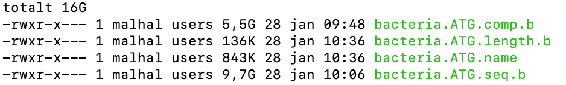

# MOSS setup guide

## Database

The moss database can be downloaded from: TBA LINK.  

The database consists of 4 KMA indexed files:     

    

The database should be a whole genome bacteria database indexed with KMA with the prefix .ATG.

## Initializing database system

Launch the moss app and in the home page click on *initialize database*.
Enter a name for the database system and select the folder containing the .ATG database you downloaded in the stop above.
Submit the initialization and wait - this process might take 5-10 minutes.

After the initialization is complete, you are now read to analyze isolate samples.