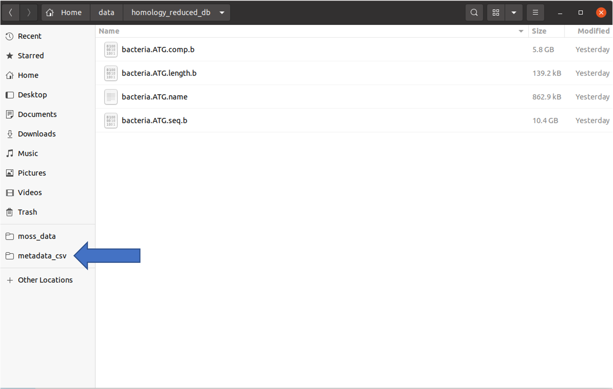

#Usage Guide

## Nanopore sequencing
Before using MOSS, Nanopore sequencing has to be carried out.
MOSS 1.0.0 has been designed to work ONLY with ONT data.
   
It is recommended that sequencing is conducted using ONT's MinKNOW software.

### Base calling
It is recommended that base calling is conducted with either high-accuracy or super-high-accuracy models.
Make sure that these are run using GPU base calling.

### FastQ
During MinKNOW sequencing base calling can be performed automatically. This will produce fastQ files, which is prefered.
 
**Make sure that GPU base calling has been [correctly configured with MinKNOW]((https://community.nanoporetech.com/docs/prepare/library_prep_protocols/experiment-companion-minknow/v/mke_1013_v1_revcf_11apr2016/installing-gpu-version-of-guppy-with-minknow-for-minion)).**

### Fast5
Alternatively, sequencing with MinKNOW can be performed without doing live base calling.
After sequencing the MOSS base calling function can be used.
The MOSS base calling section is found in the left-side menu of the app.

#### MOSS Base calling
Open the MOSS app and click on "Base calling" in the left-side menu.
Upload the folder containing subfolders named barcode01-12.
Provide a unique experiment name. The experiment name should NOT be a small, generic one.    
**Bad experiment name: nanopore_run_1**  
**Good experiment name: icu_patients_denmark_june_1_6_1996**    
Select the prefered base calling algorithm (HAC is recommended as default). Select flow-cell type, kit and barcodes.  
Finally, submit the base calling run.
    

FastQ reads will automatically be placed in /opt/moss_data/fastq. This folder is also automatically located in the left side menu of the Files finder.

## Entering meta data for sequencing run
When FastQ files have been produced, either from automated base calling with MinKNOW or through the MOSS app, it is now time to submit meta data about the experiment.
In the MOSS app go to home>metadata. Enter a unique experiment name and select all the FastQ files - There should ONLY be one FastQ file for isolate.  
The experiment name should NOT be a small, generic one.    
**Bad experiment name: nanopore_run_1**  
**Good experiment name: icu_patients_denmark_june_1_6_1996**  
An experiment name already used will not be accepted by the system.   

After entering experiment name and isolate files, hit the *Generate meta data table* button.
Fill in the corresponding meta data for each isolate and generate the meta data sheet.
 
    

**The generated meta data sheet can be found in the folder *metadata_csv*, which automatically has been added to the favorite left sidebar of the file selection.**
    

## Running an analysis
After successfully generating a meta data sheet for your sequencing experiment, go to *Home > Analyse*.  
Select the meta data sheet and submit the analyses. The progress and result of the analysis can be seen in the *Results* section in the left-side menu.
 
    

**Clicking on the little report icon to the right of the samples will open their PDF report.
Generating the PDF is the last step of the pipeline and so a blank document will open if the analysis has not completed**

